## Configuration de l'environnement de développement

## Avec Docker

L'application est entièrement dockerisée pour simplifier le développement. Voici les étapes pour exécuter les conteneurs Docker.

NB: Assurez-vous que Docker et Docker Compose sont installés sur votre machine.

### Construire les images Docker

Dans le dossier racine du projet (où se trouvent vos fichiers docker-compose.yml), exécutez la commande suivante pour construire les images :

```bash
docker-compose build
```

### Démarrer les conteneurs

Pour démarrer l'application, exécutez :

```bash
docker-compose up
```

Cette commande démarre tous les services nécessaires :

-  Le serveur backend (Nest.js)
-  Le serveur frontend (React)
-  La base de données PostgreSQL

Une fois que tout est en place, l'application est accessible sur http://localhost:5173


### Arrêter mes conteneurs

Pour arrêter les conteneurs, exécutez :

```bash
docker-compose down

```

## Sans Docker

### Les fichiers `.env`

Créer les fichiers `.env` de frontend et backend à partir des fichiers `.env.example`

### Générer la base de données

Exécutez cette commande dans le dossier backend :

```bash
npx prisma migrate dev
```

ou

```bash
npx prisma migrate dev --name init
```

### Lancer le serveur backend

Exécutez cette commande dans le dossier backend :

```bash
npm run start:dev
```

### Lancer le serveur frontend

Exécutez cette commande dans le dossier frontend :

```bash
npm run dev
```

## Authentification et Autorisation

Un unique compte avec le role SUPADMIN est créé dès la migration de la base de données:

Email : supadmin@eshop.com
Mot de passe : 0000

Ainsi que deux autres comptes utilisateurs sont déjà existants dans la base de données pour les tests :

Compte administrateur avec tous les privilèges (admin, client, vendeur) :

Email : allroles@eshop.com
Mot de passe : 0000

Compte client simple :

Email : client@eshop.com
Mot de passe : 0000


### Mécanisme d'authentification et d'autorisation

#### Inscription (`/auth/signup`)

-  Enregistrement d'un utilisateur avec validation des données (email, mot de passe, prénom, nom, rôles).

-  Hachage sécurisé des mots de passe avec **Argon2**.

-  Création automatique d'un panier (cart) pour les utilisateurs avec le rôle `CLIENT`.

-  Retourne un jeton JWT pour l'utilisateur enregistré.

#### Connexion (`/auth/login`)

-  Authentification d'un utilisateur avec ses identifiants (email et mot de passe).

-  Vérification du mot de passe haché.

-  Retourne un jeton JWT pour un accès sécurisé aux routes protégées.

#### Protection des routes

-  Utilisation de **JWT** pour protéger les endpoints sensibles.

-  Vérification des rôles avec un décorateur personnalisé `@AuthRoles`.

#### Gestion des rôles

-  Différents rôles utilisateur (exemple : `SUPADMIN`, `ADMIN`, `CLIENT`, `SELLER`) pour restreindre l'accès aux fonctionnalités spécifiques.

#### `AuthController`

Ce contrôleur gère les endpoints suivants :

-  **POST `/auth/signup`** : Inscrit un nouvel utilisateur.

-  **POST `/auth/login`** : Connecte un utilisateur existant.

#### `AuthService`

Service contenant la logique métier pour :

-  Inscrire les utilisateurs en hachant leurs mots de passe.

-  Authentifier les utilisateurs et générer des tokens JWT.

-  Valider les rôles des utilisateurs.

#### DTOs (Data Transfer Objects)

-  **`SignupDTO`** : Valide les données d'inscription (email, mot de passe, prénom, etc.).

-  **`LoginDTO`** : Valide les données de connexion (email, mot de passe).

#### JWT Strategy

Stratégie pour valider les tokens JWT :

-  Extrait le token JWT des en-têtes HTTP (`Authorization`).

-  Vérifie la validité du token et extrait les informations de l'utilisateur (ID, email).

-  Ajoute les données de l'utilisateur à la requête.

#### Décorateur `@AuthRoles`

Permet de restreindre l'accès à certaines routes selon les rôles. Exemple :

```typescript
@AuthRoles(Role.ADMIN, Role.SELLER)
@Get('dashboard')
getDashboard() {
  return this.dashboardService.getData();
}
```

#### Décorateur `@GetUser`

Permet d'accéder facilement aux informations de l'utilisateur connecté :

```typescript
@GetUser() user: User
@GetUser('email') email: string
```

---

## Diagramme de classes

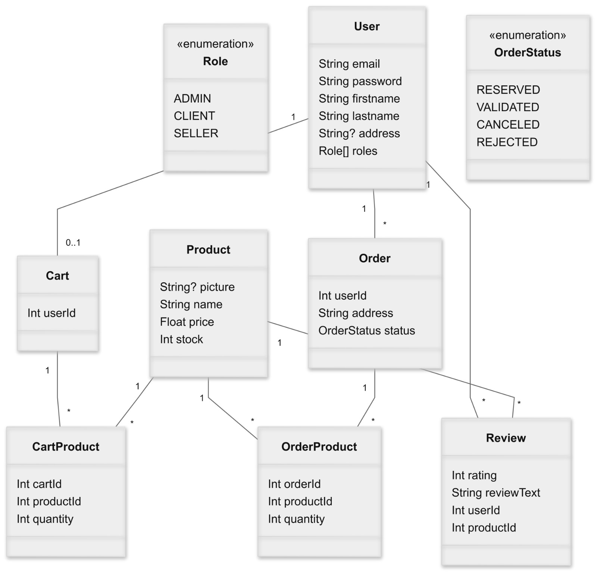

## Les fonctionnalités de l'application

-  Un superadmin qui peut activer et désactiver les comptes des utilisateurs ayant les rôles `ADMIN` et/ou `SELLER`.

-  Un vendeur peut valider ou refuser les commandes passées par des clients.

-  Un administrateur et un vendeur qui peut ajouter et modifier des produits et leur stock disponible.

-  Le client peut :

   -  Modifier son profil (adresse, mot de passe, nom, etc).

   -  Ajouter des produits avec leur quantité au panier.

   -  Modifier le contenu de son panier.

   -  Passer une commande à partir de son panier avec son adresse principale ou une adresse spécifique.

   -  Annuler une commande avant qu'elle soit traitée par le vendeur (ou l'administrateur).

   -  Le client peut récupérer la facture de sa commande à partir de `/orders` en cliquant sur la commande en question pour voir ses détails et l'imprimer.

   -  Noter un produit et laisser un commentaire.

---

## Captures d'écran des fonctionnalités

### **1. Interface d'inscription**

Voici l'interface d'inscription où les utilisateurs peuvent créer un compte en fournissant leurs informations :

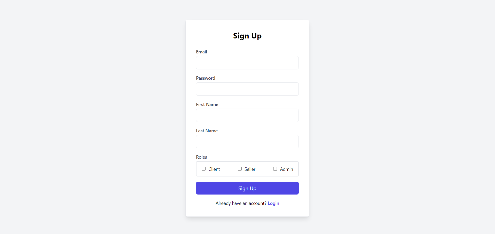

---

### **2. Interface de connexion**

L'interface de connexion permet aux utilisateurs existants de se connecter avec leur email et leur mot de passe :

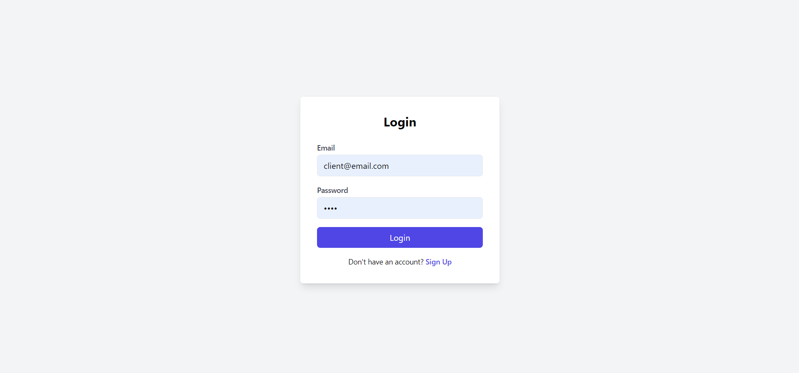

---

### **3. Dashboard pour les vendeurs/Les admins**

Le tableau de bord des vendeurs affiche les commandes en attente, les produits en stock:

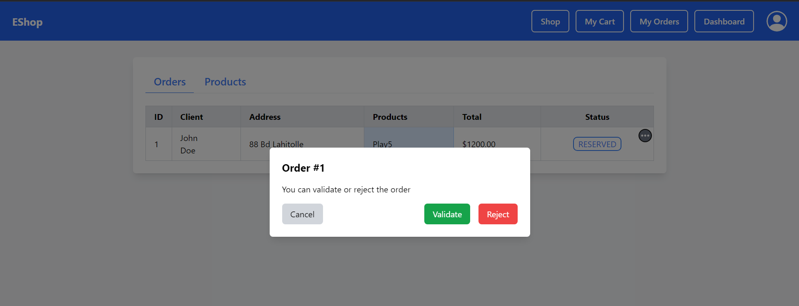

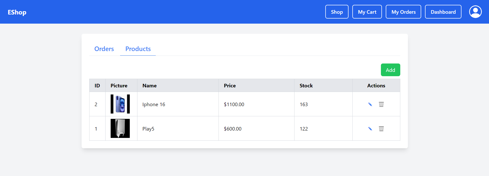

## 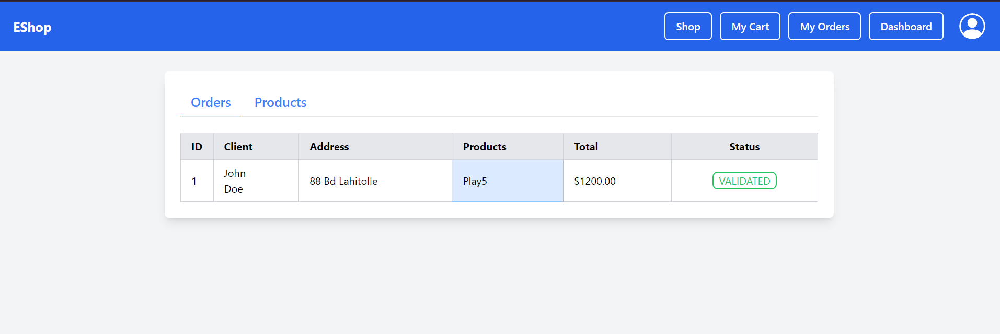

### **4. Gestion du panier pour les clients**

Les clients peuvent ajouter, modifier ou supprimer des produits dans leur panier via une interface intuitive :

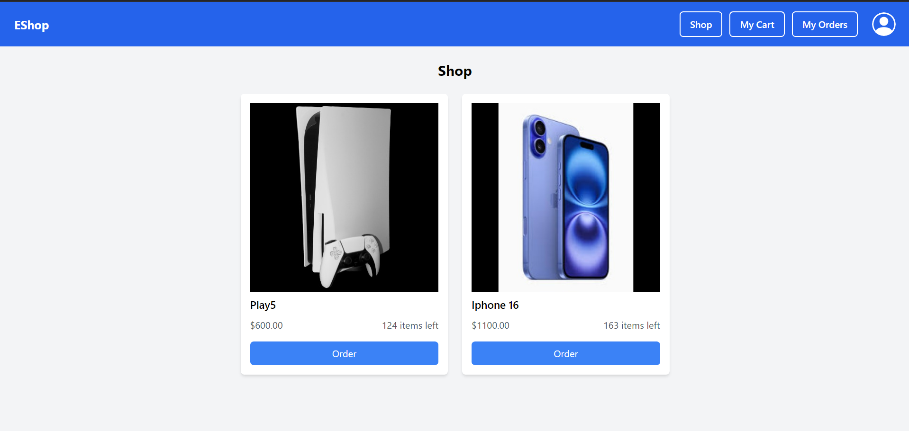

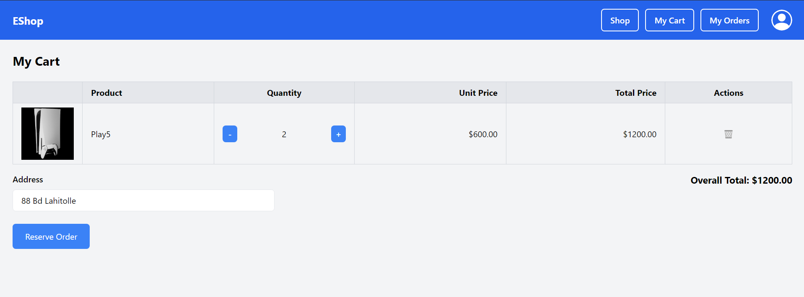

---

### **5. Notation et review d'un produit**

Le client peut noter un produit et laisser un commentaire:

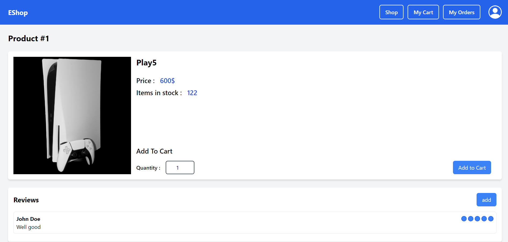

### **6. Détails des commandes**

Les clients peuvent consulter les détails de leurs commandes et imprimer une facture :

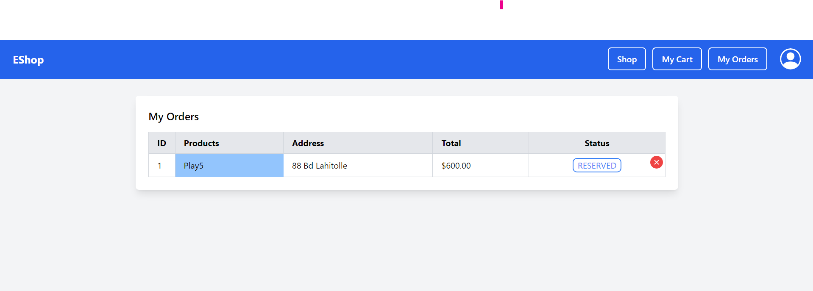

En cliquant sur la commande (la case bleue):

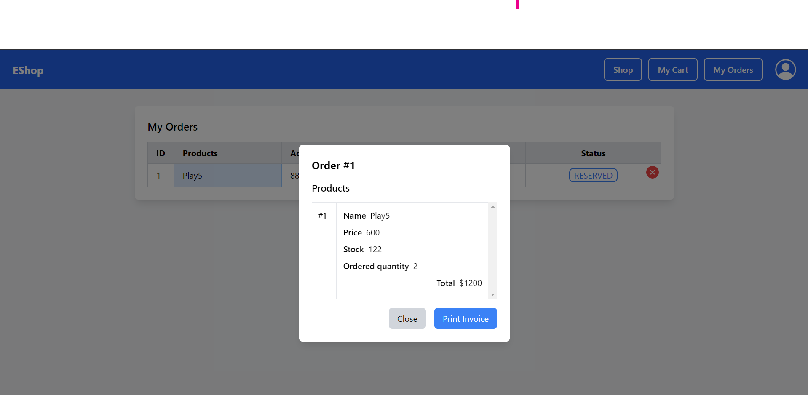

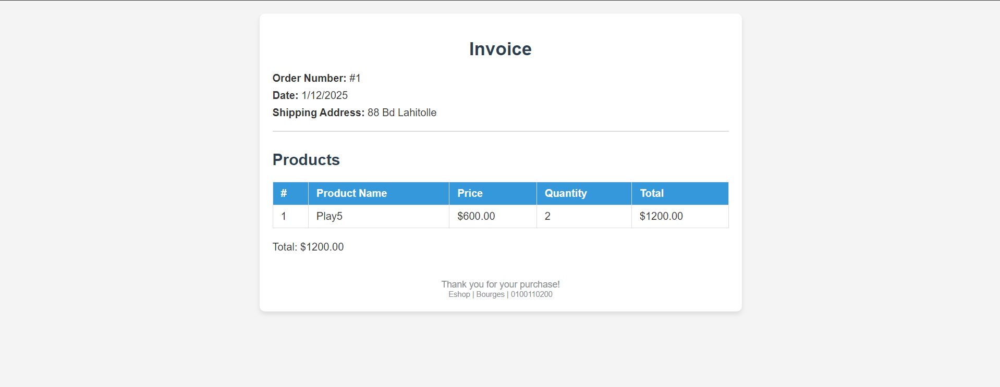

---

### \*\*7. Modification des coordonnées personnelles

Les utilisateurs peuvent modifier leurs informations:

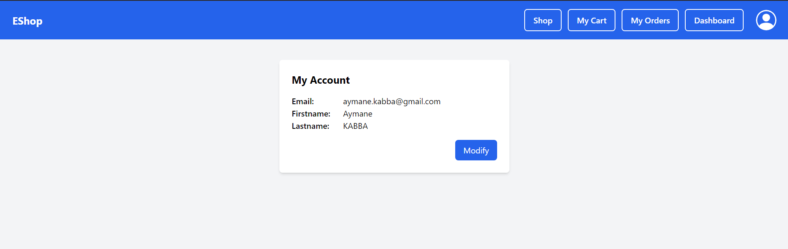

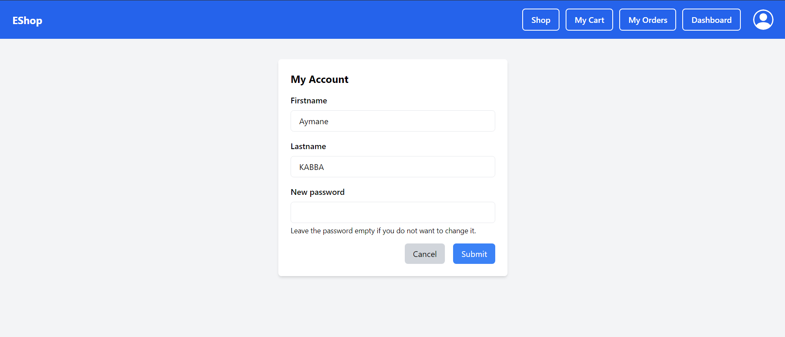

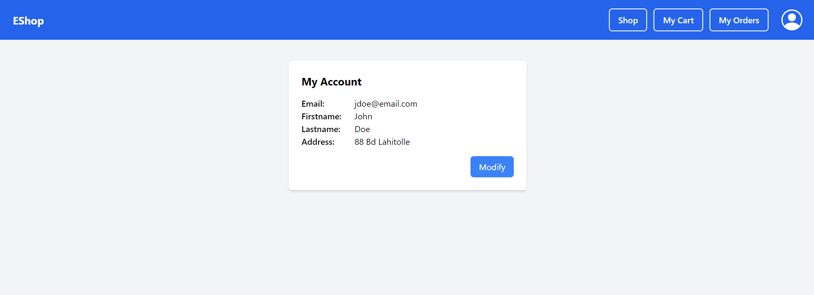

### \*\*8. Authorized Page

Cette page a pour but de démontrer que l'admin/seller n'a pas le droit de consulter un panier (le clique sur My Cart é My Orders), d'où l'affichage de ce message:

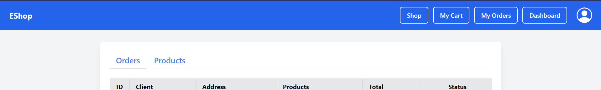

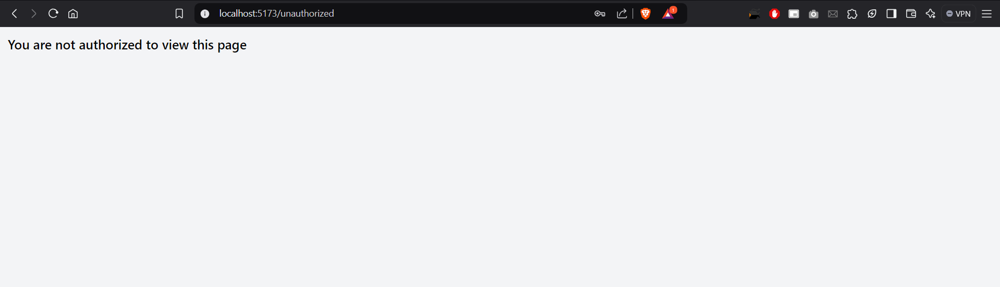
